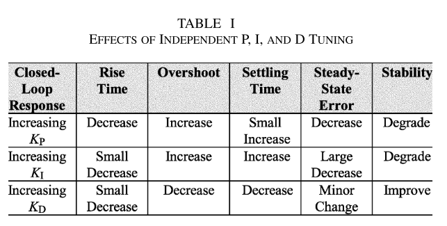
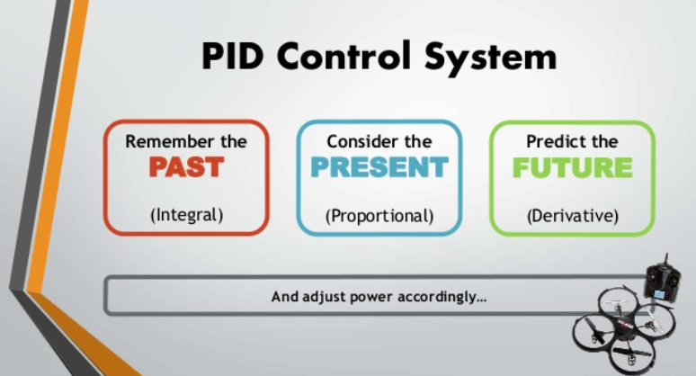
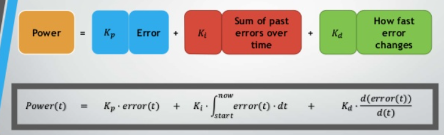
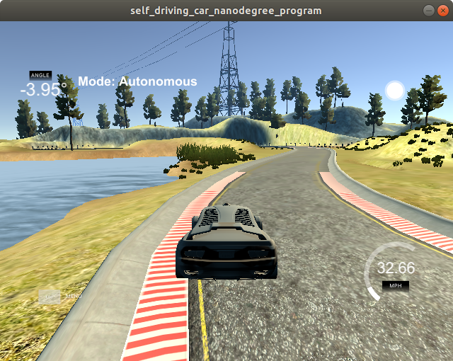

# CarND-Controls-PID
Self-Driving Car Engineer Nanodegree Program


---

## Writeup

Link of video:https://www.youtube.com/watch?v=o_OiYE244Lo


As the invention of PID control in 1910 (largely owning to Elmer Sperry’s ship autopilot), and the Ziegler–Nichols’ (Z-N) straightforward tuning methods in 1942, the prevalence of PID control has increased tremendously. With advances in digital technology, the science of automatic control now allows a extensive spectrum of control schemes choices. However, more than 90% of industrial controllers are still implemented based around PID algorithms, particularly at lowest levels (Martins, M. V. A., Watanabe, S., Totah, V., Botelho, A. P., Silva, M. C. da, Neres, P. F., Lima, R. de C. C., Rizzo, A. E., Pimenta, A., Brasil, A. C. dos S., Amaral, A. C., Soares, C. H. C., Santos, C. S. G., Ruta, C., Oliveira, C. D. de C., Serejo, C. S., Figueiredo, E., Passos, F. D., Noel, F., … Oliveira, V. M. de. (2017). PID Control System Analysis, Design.pdf. Ambiente Bentônico, Vol 3, 13(November), xi–xiv. https://doi.org/10.1016/b978-85-352-7263-5.50018-7).

The PID controller is a feedback mechanism extensively applied in a diversity of applications. The controller calculates an “error” that is the difference between an evaluated process variable and the desired set-point value required by the application. PID controllers will attempt to decrease the process error by continuously adjusting the inputs. Although this is a powerful tool, the controllers must be correctly tuned if they are useful. Additionally, the weaknesses of a PID controller should be recognized in order to ensure that they are not used in applications that cannot make use of their unique advantages (Costa, G. J. (2010). Tuning a PID Controller. Power Transmission Engineering, april, 26–31).


The “three-term” functionalities are highlighted by the following. 


• The proportional term—providing an overall control action proportional to the error signal through the all-pass gain factor

   The integral term—reducing steady-state errors through low-frequency compensation by an integrator.
• The derivative term—improving transient response through high-frequency compensation by a differentiator

 


(Martins, M. V. A., Watanabe, S., Totah, V., Botelho, A. P., Silva, M. C. da, Neres, P. F., Lima, R. de C. C., Rizzo, A. E., Pimenta, A., Brasil, A. C. dos S., Amaral, A. C., Soares, C. H. C., Santos, C. S. G., Ruta, C., Oliveira, C. D. de C., Serejo, C. S., Figueiredo, E., Passos, F. D., Noel, F., … Oliveira, V. M. de. (2017). PID Control System Analysis, Design.pdf. Ambiente Bentônico, Vol 3, 13(November), xi–xiv. https://doi.org/10.1016/b978-85-352-7263-5.50018-7).

- P: affects readiness, can lead to oscillations
- I: corrects the steady state error, can lead tp instability
- D: dampens system born oscillations, but sensitive to input noise



 (https://www.slideshare.net/AbarajithanGnaneswar/pid-control-system-for-dummies)




### Parameter Tuning

I started to manual custom to the parameters available.  I began just with K_d  pid.Init(0.1, 0.1, 1.5) pid.Init(0.1, 0.1, 1)  and decreased before the automobile was oscillating inside the street.   I then tuned K_i  before the oscillation went down pid.Init(0.1, 0.001, 1).  However, with these parameters that the automobile identification does not steer enough in corners.  I increased K_d  in precisely the same manner until the automobile would also steer enough in corners pid.Init(0.1, 0.001, 1.5) pid.Init(0.1, 0.001, 2).  To avoid the car  pop up onto ledges (Figure bellow),   I increase the readiness of your system (P) and (D) to maintain the stability. This parameter sets the car drives the entire trail without leaving the lane.




The final values are:
``K_p = 0.6 `` ``K_i = 0.001 `` ``K_d = 6 ``

---

## Dependencies

* cmake >= 3.5
 * All OSes: [click here for installation instructions](https://cmake.org/install/)
* make >= 4.1(mac, linux), 3.81(Windows)
  * Linux: make is installed by default on most Linux distros
  * Mac: [install Xcode command line tools to get make](https://developer.apple.com/xcode/features/)
  * Windows: [Click here for installation instructions](http://gnuwin32.sourceforge.net/packages/make.htm)
* gcc/g++ >= 5.4
  * Linux: gcc / g++ is installed by default on most Linux distros
  * Mac: same deal as make - [install Xcode command line tools]((https://developer.apple.com/xcode/features/)
  * Windows: recommend using [MinGW](http://www.mingw.org/)
* [uWebSockets](https://github.com/uWebSockets/uWebSockets)
  * Run either `./install-mac.sh` or `./install-ubuntu.sh`.
  * If you install from source, checkout to commit `e94b6e1`, i.e.
    ```
    git clone https://github.com/uWebSockets/uWebSockets 
    cd uWebSockets
    git checkout e94b6e1
    ```
    Some function signatures have changed in v0.14.x. See [this PR](https://github.com/udacity/CarND-MPC-Project/pull/3) for more details.
* Simulator. You can download these from the [project intro page](https://github.com/udacity/self-driving-car-sim/releases) in the classroom.

Fellow students have put together a guide to Windows set-up for the project [here](https://s3-us-west-1.amazonaws.com/udacity-selfdrivingcar/files/Kidnapped_Vehicle_Windows_Setup.pdf) if the environment you have set up for the Sensor Fusion projects does not work for this project. There's also an experimental patch for windows in this [PR](https://github.com/udacity/CarND-PID-Control-Project/pull/3).

## Basic Build Instructions

1. Clone this repo.
2. Make a build directory: `mkdir build && cd build`
3. Compile: `cmake .. && make`
4. Run it: `./pid`. 

Tips for setting up your environment can be found [here](https://classroom.udacity.com/nanodegrees/nd013/parts/40f38239-66b6-46ec-ae68-03afd8a601c8/modules/0949fca6-b379-42af-a919-ee50aa304e6a/lessons/f758c44c-5e40-4e01-93b5-1a82aa4e044f/concepts/23d376c7-0195-4276-bdf0-e02f1f3c665d)

## Editor Settings

We've purposefully kept editor configuration files out of this repo in order to
keep it as simple and environment agnostic as possible. However, we recommend
using the following settings:

* indent using spaces
* set tab width to 2 spaces (keeps the matrices in source code aligned)

## Code Style

Please (do your best to) stick to [Google's C++ style guide](https://google.github.io/styleguide/cppguide.html).

## Project Instructions and Rubric

Note: regardless of the changes you make, your project must be buildable using
cmake and make!

More information is only accessible by people who are already enrolled in Term 2
of CarND. If you are enrolled, see [the project page](https://classroom.udacity.com/nanodegrees/nd013/parts/40f38239-66b6-46ec-ae68-03afd8a601c8/modules/f1820894-8322-4bb3-81aa-b26b3c6dcbaf/lessons/e8235395-22dd-4b87-88e0-d108c5e5bbf4/concepts/6a4d8d42-6a04-4aa6-b284-1697c0fd6562)
for instructions and the project rubric.

## Hints!

* You don't have to follow this directory structure, but if you do, your work
  will span all of the .cpp files here. Keep an eye out for TODOs.

## Call for IDE Profiles Pull Requests

Help your fellow students!

We decided to create Makefiles with cmake to keep this project as platform
agnostic as possible. Similarly, we omitted IDE profiles in order to we ensure
that students don't feel pressured to use one IDE or another.

However! I'd love to help people get up and running with their IDEs of choice.
If you've created a profile for an IDE that you think other students would
appreciate, we'd love to have you add the requisite profile files and
instructions to ide_profiles/. For example if you wanted to add a VS Code
profile, you'd add:

* /ide_profiles/vscode/.vscode
* /ide_profiles/vscode/README.md

The README should explain what the profile does, how to take advantage of it,
and how to install it.

Frankly, I've never been involved in a project with multiple IDE profiles
before. I believe the best way to handle this would be to keep them out of the
repo root to avoid clutter. My expectation is that most profiles will include
instructions to copy files to a new location to get picked up by the IDE, but
that's just a guess.

One last note here: regardless of the IDE used, every submitted project must
still be compilable with cmake and make./

## How to write a README
A well written README file can enhance your project and portfolio.  Develop your abilities to create professional README files by completing [this free course](https://www.udacity.com/course/writing-readmes--ud777).

